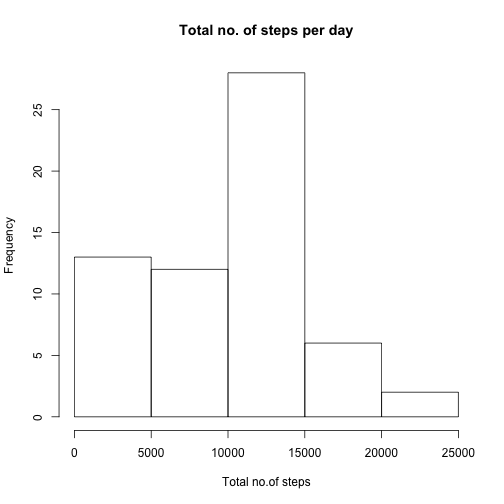
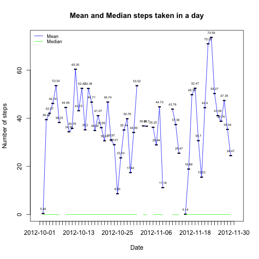
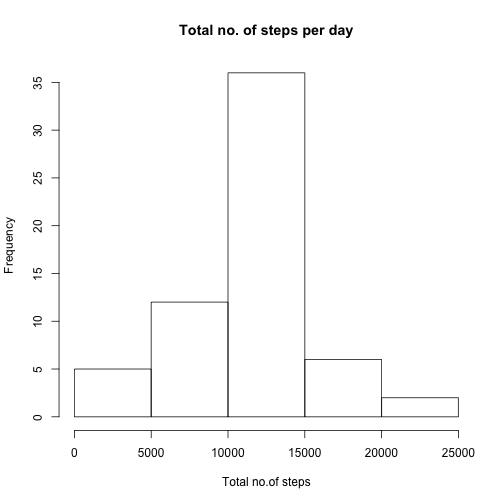
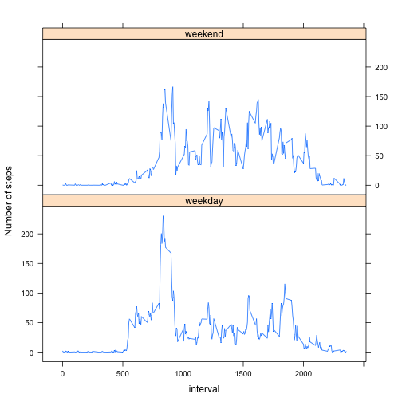

This is an R Markdown document for PA 1 of the Reproducable Research course. 

###1. Mean total number of steps taken per day

+ Use the dplyr functions to calculate the total number of steps as well as the mean and median steps taken per day.


```r
library(dplyr)

activity <- read.csv("activity.csv")

get_activity_datewise <- function(activity) { 
    
    datewise_activity <- 
        activity %>% 
        group_by(date) %>% 
        summarise(total_steps=sum(steps,na.rm=TRUE), 
              median_steps=median(steps,na.rm=TRUE), 
              mean_steps=mean(steps,na.rm=TRUE))
}

datewise_activity <- get_activity_datewise(activity)
```


###2. Plot the histogram of total steps taken per day.


```r
hist(datewise_activity$total_steps, 
     main="Total no. of steps per day", 
     xlab="Total no.of steps")
```

 

###3. Report the mean and median values of steps.

+ The text function is used to label the data values into the plot to report the mean values. The median is zero for all dates (labels have been skipped due this reason).


```r
plot_activity_datewise <- function(datewise_activity) {

    plot(datewise_activity$mean_steps ~ datewise_activity$date, 
         type="n", 
         main="Mean and Median steps taken in a day", 
         xlab="Date", 
         ylab="Number of steps")
    
    lines(datewise_activity$mean_steps ~ datewise_activity$date, lwd=1, col="blue")
    text(datewise_activity$date, datewise_activity$mean_steps+2, round(datewise_activity$mean_steps, 2), cex=0.5)
    lines(datewise_activity$median_steps ~ datewise_activity$date, lwd=1, col="green")
    
    legend('topleft', c("Mean", "Median"), lty=1, col=c("blue", "green"), bty='n', cex=.75)
}

plot_activity_datewise(datewise_activity)
```

 

+ For certain dates, there is no data present at all which is indicated by the breaks in the mean and median lines.
+ The median is zero for all dates, which shows that the subject is inactive for most 5 minute intervals of the day.

###4. Daily activity pattern by 5 minute interval average steps across all days.

+ Calculate the mean steps for an interval across all days
+ Plot mean steps by interval
+ Use the which.max function to find the row no. with the max value of average steps
+ Use text function to label the max average steps and the interval with the max average steps


```r
get_activity_intervalwise <- function(activity) {

intwise_activity <-
    activity %>%
    group_by(interval) %>%
    summarise(mean_steps=mean(steps,na.rm=TRUE))
}

intwise_activity <- get_activity_intervalwise(activity)

plot_activity_intervalwise <- function (intwise_activity) {

    plot(intwise_activity$mean_steps ~ intwise_activity$interval, 
         type="l", 
         main="Daily activity pattern averaged across all days", 
         xlab="interval",
         ylab="Number of steps")
    
    max_row_no <- which.max(intwise_activity$mean_steps)
    
    max_interval <- intwise_activity$interval[max_row_no]
    max_mean_steps <- intwise_activity$mean_steps[max_row_no]
    
    text(max_interval, max_mean_steps, 
         paste(round(max_mean_steps, 2), "," , "interval=", max_interval), 
         cex=0.5)
}

plot_activity_intervalwise(intwise_activity)
```

 

###5. Calculate the total number of missing values in the dataset


```r
print(sum(is.na(activity$steps)))
```

```
## [1] 2304
```

###6. Create a new dataset with missing data filled in

+ Use the assign function to make a copy of the activity data frame
+ The missing data values are filled in with the mean for that 5 minute interval
+ for each row where the "steps" value is missing ( provided by the which(is.na()) function calls), the missing value is filled in with the mean_step value for the interval by looking up the "intwise_activity" data frame


```r
assign("imputed_activity", activity)

for (i in which(is.na(imputed_activity$steps))) {
    imputed_activity$steps[i] <- 
        intwise_activity$mean_steps[intwise_activity$interval==imputed_activity$interval[i]]
}
```

###7. Histogram and plot for mean and median of total number of steps taken per day with imputed values


```r
imp_datewise_activity <- get_activity_datewise(imputed_activity)

hist(imp_datewise_activity$total_steps, 
     main="Total no. of steps per day", 
     xlab="Total no.of steps")
```

 

+ The frequency of total number of steps between 10K to 15K has increased with the imputed data


```r
plot_activity_datewise(imp_datewise_activity)
```

 

```r
imp_intwise_activity <- get_activity_intervalwise(imputed_activity)

plot_activity_intervalwise(imp_intwise_activity)
```

 

+ The median with imputed data is still largely "zero" as with the "missing" dataset, except for the dates where no data was present at all, where due to the strategy used, the median and mean are same or close
+ The mean does not show any significant change in pattern between the "missing" dataset vs the "imputed" dataset
+ The interval wise daily pattern does not show any change in pattern either, as is expected since the "mean"" values were used to "impute" the data

###8. Activity pattern difference between weekdays and weekends

+ Pre-process the imputed dataset to determine if the date falls on a weekend or a weekday using as.POSIXlt, better than weekdays function
 for the problem at hand
+ Group by interval and weekday/weekend to average the number of steps and then plot the average steps by intervals split by weekday/weekend


```r
imputed_activity <- transform(imputed_activity, wkday = as.POSIXlt(date)$wday)
imputed_activity$wkday[imputed_activity$wkday %in% c(1,2,3,4,5)] <- "weekday"
imputed_activity$wkday[imputed_activity$wkday %in% c(0,6)] <- "weekend"

intwise_wkday_activity <-
    imputed_activity %>%
    group_by(interval, wkday) %>%
    summarise(mean_steps=mean(steps,na.rm=TRUE))

library(lattice)

xyplot(mean_steps ~ interval | wkday, 
       data = intwise_wkday_activity,
       type = "l", 
       xlab = "interval",
       ylab = "Number of steps",
       layout = c(1,2))
```

 

+ The weekend has much higher level of activity between 10 hrs and 15 hrs compared to a weekday
